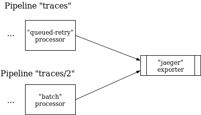
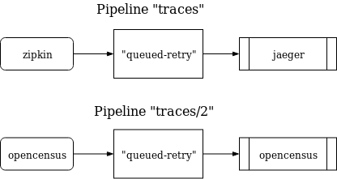

# OpenTelemetry Collector 架构

这个文档介绍了 OpenTelemetry Collector 的架构设计与实现。

## 概览

OpenTelemetry Collector 是一个可以接受观测数据并对其有选择地进行转换并进一步转发的可执行程序。

Collector 包含了下面基础的组件:

- </img>
`receivers`: 数据如何进入到Collector，它们可以是pull或者push方式
- </img>
`processors`: 数据接受后如何处理
- </img>
`exporters`: 接受后数据发送到哪里，它们可以是pull或者push方式

Collector 支持接收并发送基于多种流行的开源协议的数据，并且提供了一个可插拔的体系结构以便添加更多的协议类型。


数据的接收，转换与发送都是通过 Pipelines 来实现。 Collector 可以配置一个或多个 Pipelines 。 每个 Pipelines 都包括一组 Receivers 来负责数据的
接收，一组可选的从 Receivers 那里获取数据并进行转换的 Processors ，和一组从 Processors 当中获取数据并将数据发送到收集器外的 Exporters。 一个
Receiver 可以把数据发送给多个 Pipelines ，而多个 Pipelines 可以把数据发送给同一个 Exporter 。

## Pipelines

Pipeline 定义了 Collector 中一个从数据接收开始，然后经过进一步处理，最后通过 Exporters 离开 Collector 的数据处理流程。

Pipelines 可以操做的观测数据：traces、 metrics 和 logs  。Pipelines 中处理的数据类型是作为其的一个配置属性进行描述。 
每个 Receiver/Processor/Exporter 能够在一个或者多个Pipelines使用. 在有多个Pipelines的流程中, 每个 Pipeline 都是一个独立的进程. 但是反过来，多个Pipelines公用一个 Receiver/Exporter。一个 Pipeline的结构可以通过一下方式进行概括：


一个 Pipeline 中可以存在多个 Receivers 。每个 Receivers 中接收的数据将会被推给 Pipeline 中的第一个 Processor 进行处理并将处理后的结果推送给下一个 Processor
进行处理（在这个过程中，可能会有数据被抛弃，比如在一个"采样"的 Processor 的处理过程中）并以此类推到最后一个 Processor 处理完毕后将会把数据推送给
Exporters 。每个 Exporters 都会有一个数据的拷贝。最后一个 Processor 通过 `FanOutConnector` 将数据扇出到每一个 exporter 上面。

Pipeline 将会在 Collector 的启动过程中基于被配置文件所描述的配置进行初始化。

一个 Pipeline 的典型配置如下所示：

```yaml
service:
  pipelines: # section that can contain multiple subsections, one per pipeline
    traces:  # type of the pipeline
      receivers: [opencensus, jaeger, zipkin]
      processors: [tags, tail_sampling, batch, queued_retry]
      exporters: [opencensus, jaeger, stackdriver, zipkin]
```

上述的实例配置描述了一个处理 "traces" 类型的观测数据，并配置了 3 个 Receivers ， 4 个 Processors ， 3 个的 Exporters Pipeline 。

关于配置文件更详细的配置描述可以查看[这个文档](https://docs.google.com/document/d/1NeheFG7DmcUYo_h2vLtNRlia9x5wOJMlV4QKEK05FhQ/edit#) 。

### Receivers

Receivers 通常会监听一个网络端口并接收观测数据。通常情况下，一个 Receiver 会被配置为将接收到的数据发送到一个 Pipeline 中去，当然同一个 Receiver
将数据发送到多个 Pipeline 中去也是可行的。只需要在几个 Pipeline 中将 “receivers” 的 key 均配置为同一个即可：

```yaml
receivers:
  opencensus:
    endpoint: "0.0.0.0:55678"

service:
  pipelines:
    traces:  # a pipeline of “traces” type
      receivers: [opencensus]
      processors: [tags, tail_sampling, batch, queued_retry]
      exporters: [jaeger]
    traces/2:  # another pipeline of “traces” type
      receivers: [opencensus]
      processors: [batch]
      exporters: [opencensus]
```

在上面的例子中， “opencensus” receiver 将会把相同的数据发送到 pipeline “traces” 和 pipeline “traces/2” 中去。（值得一提的是配置文件中
使用 `type[/name]` 的格式来定一个组件名称，具体的格式可以查看
[这个文档](https://docs.google.com/document/d/1NeheFG7DmcUYo_h2vLtNRlia9x5wOJMlV4QKEK05FhQ/edit#) ）。

当 Collector 通过上述的配置进行加载后的结果将会如下所示（为了更加简洁，图中省略了 Processor 和 Exporter 部分）：


重要：当多个 Pipeline 引用了同一个 Receiver 的时候，该 Receiver 仅会在运行期间创建一个实例。该实例将会把数据发送到 `FanOutConnector` 中，
而后者将会把数据发送到每一个 Pipeline 中的第一个 Processor 当中。从 Receiver 到 `FanOutConnector` 最后到 Processor 的这个数据传播的过程
中，是通过同步函数的调用来实现的。这代表在这个过程中，如果一个 Process 的处理过程阻塞了， 那么连接到此 Receiver 的 Processor 数据处理都会被
阻塞，并且该 Receiver 将会停止处理和转发新接受到的数据。

### Exporters

Exporters 通常会通过网络将数据发送到到一个远程目的地（当然也可以通过别的方式，比如 “logging” exporter 将会把观测数据写入到本地文件中）。

配置文件支持多个 Exporter 支持同一种类型的协议，甚至在同一个 Pipeline 中也支持这样的配置。比如下面的例子中，2 个 “opencensus” 支持将数据发送到
不同的 opencensus 远程端口中：

```yaml
exporters:
  opencensus/1:
    endpoint: "example.com:14250"
  opencensus/2:
    endpoint: "0.0.0.0:14250"
```

通常情况下，一个 Exporter 将会从一个 Pipeline 中获取数据，但是配置一个 Exporter 从多个 Pipeline 中接收数据也是可以的，比如：

```yaml
exporters:
  jaeger:
    protocols:
      grpc:
        endpoint: "0.0.0.0:14250"

service:
  pipelines:
    traces:  # a pipeline of “traces” type
      receivers: [zipkin]
      processors: [tags, tail_sampling, batch, queued_retry]
      exporters: [jaeger]
    traces/2:  # another pipeline of “traces” type
      receivers: [opencensus]
      processors: [batch]
      exporters: [jaeger]
```

在上面的例子中，一个 “jaeger” exporter 可以从 Pipeline “traces” 和 Pipeline “traces/2” 中获取数据。当 Collector 根据配置文件完成加载后，
结构如图所示（为了简洁起见， Receiver 和 Processor 部分被省略了）：



### Processors

一个 Pipeline 可以将各个 Processors 顺序链接。第一个 Processor 可以根据 Pipeline 的配置从多个或者一个 Receivers 中获取数据，相应的， 最后
一个 Processor 将会根据配置把数据发送到一个或多个 Exporters 中去。而两者之间的 Processor 将会只从前置 Processor 中获取数据并将数据发送到后置
的 Processor 中去。

Processors 可以将数据在传递之前将其进行转换（比如从 span 当中添加一个属性），也可以将数据进行丢弃（比如一个"采样"的 Processor），也可以产生
新的数据（比如一个 “persistent-queue” Processor 将会在 Collector 重启之后从本地文件中读取先前保存的数据在 Pipeline 中进行发送）。

在多个 Pipelines 之间可以通过 “processors” key 来声明同一个 Processor 。在这个配置下，每个 Pipeline 都将会根据此进行配置，但是每个 Pipeline
都拥有一个该 Pipeline 的实例。每个 Processor 都会持有一个状态，这个状态在不同的 Pipeline 之间并不会共享。打个比方，如果一个 “queued_retry”
Processor 被多个 Pipeline 进行配置，每个 Pipeline 都会持有其自己的队列（即使每个队列在配置文件都是通过同一个 key 引用了相同的配置），打个
比方如下：

```yaml
processors:
  queued_retry:
    size: 50
    per-exporter: true
    enabled: true

service:
  pipelines:
    traces:  # a pipeline of “traces” type
      receivers: [zipkin]
      processors: [queued_retry]
      exporters: [jaeger]
    traces/2:  # another pipeline of “traces” type
      receivers: [opencensus]
      processors: [queued_retry]
      exporters: [opencensus]
```

当 Collector 根据上面的配置进行加载后的结果将会如下所示：



值得一提的是这里的每个 “queued_retry” processor 都是一个独立的实例，即使都是同样的方式被配置，比如它们的大小都是 50。

## <a name="opentelemetry-agent"></a>作为一个代理运行

在一个典型的虚拟机或者容器中，在用户的应用上运行集成或者 pods 通过 OpenTelemetry Library （library）来进行收集。以前， Library 将会进行
针对 spans/stats/metrics 的收集记录采样与聚合，并且会将这部分数据导出到其他的持久化后端当中去或者在本地页面进行展示。这样的模式有以下几点
弊端，如下所示：

1. 每个 OpenTelemetry Library， exporters 或者本地页面都需要通过原生语言进行实现。
2. 在一些编程语言中（比如 Ruby， PHP），在进程中很难对状态进行聚合操作。
3. 为了能够导出 OpenTelemetry span/stats/metrics，用户的应用程序需要手动添加 Library 导出器并重新部署其二进制文件。当已经发生了一个事件，用户
   很难通过 OpenTelemetry 立即进行排查。
4. 应用用户需要在配置中进行配置以便能够对 exporters 进行初始化。这很容易出错（比如并没有正确对验证/监控资源进行配置），并且用户也很可能不希望在代码
   被中 OpenTelemetry 所"污染"。

为了解决上述的问题，你可以将 OpenTelemetry Collector 作为一个 Agent 运行。这个 Agent 将会作为一个是守护进程运行在 虚拟机或者容器当中并可以独立
Library 进行部署。一旦这个 Agent 被部署并运行，它应该能够从 Library 中获取 spans/stats/metrics 并将其导出到别的后端当中。我们当然也可以给予
其推送配置（比如采样率）到 Library 的能力。对于不能在进程中进行状态聚合的语言而言，它们还需要发送原始数据到 Agent 当中进行聚合。


对于别的 Library 的开发者/maintainer 来说： Agent 也可以从别的 链路/监控 Library 中接收 spans/stats/metrics 数据，比如 zipkin 和
prometheus 等等。这可以通过添加特定的 Receiver 来实现，可以查看 [Receivers](#receivers) 来查看更多细节。

## <a name="opentelemetry-collector"></a>作为一个独立 Collector 运行

OpenTelemetry Collector 也可以作为一个独立实例运行并且接收由其他 Agent 或者 Library 所导出或者所支持的协议内的 task/agent 所导出的
spans 和 metrics 数据。 Collector 可以配置为发送数据到多个配置的 exporter 上。下面的图片总结了部署体系结构：


OpenTelemetry Collector 通过其他配置方式部署，比如通过其 Recevier 所支持的数据格式之一从别的 agent 或者客户端处接收数据。

### <a name="agent-communication"></a>OpenCensus 协议

TODO: 该部分应该被移到其他地方么，因为本文档主旨为介绍非协议特定的部分

OpenCensus Protocol 使用双向的 gRPC stream 。发送方需要初始化连接，因为 Agent 处只有一个专用端口，而可能会有多个进行传输的进程。在默认情况下，
Collector 使用端口 55678。

#### <a name="agent-protocol-workflow"></a>Protocol 工作流

1. 发送方将会尝试为了 Config 和 Export 的流而直接打开连接。
2. 发送方必须在每一条的第一个消息中发送其身份标识符。发送方的每个身份标识符都应该是在虚拟机或者容器中独一无二的。如果在第一个消息中没有携带这个身份标识符。
   那么 Collector 将会丢弃消息并返回一个错误给客户端。此外，第一条消息中也可能携带其他信息（比如 `Span`）。只要发送了有效的身份标识符，那么
   Collector 就应该像这些数据是通过后续消息发送过来的那样正常处理这些数据。一旦流被建立，身份标识符就不再被需要。
3. 在发送方这端如果和 Collector 所建立的连接失败了，发送方应该在可用/配置的内存缓冲大小下无限期的地重试下去（这么做的原因是考虑到这样的场景：用户的
   应用已经通过 OpenTelemetry Library 进行观测，但是 Collector 还没有部署。也许在未来的某个时候我们简单地将 Collector 部署到这个环境中， Library
   将会在不断的重试中自动连接到 Collector 上。而在这个过程中，我们不需要对应用进行任何的修改）。取决于编程语言的实现，重试将会在后台或者守护线程
   中进行。重试应该以一定的频率进行（而不是指数衰减），以便获得一个可预期的连接成功的时间。
4. 在 Collector 端，如果一个以建立的流被关闭，相应的连接对应的身份标识符也会被视为过期。发送者应该重新建立一个连接并重新携带一个不会重复的身份标识
   符（也许可与和之前的不一样）。

